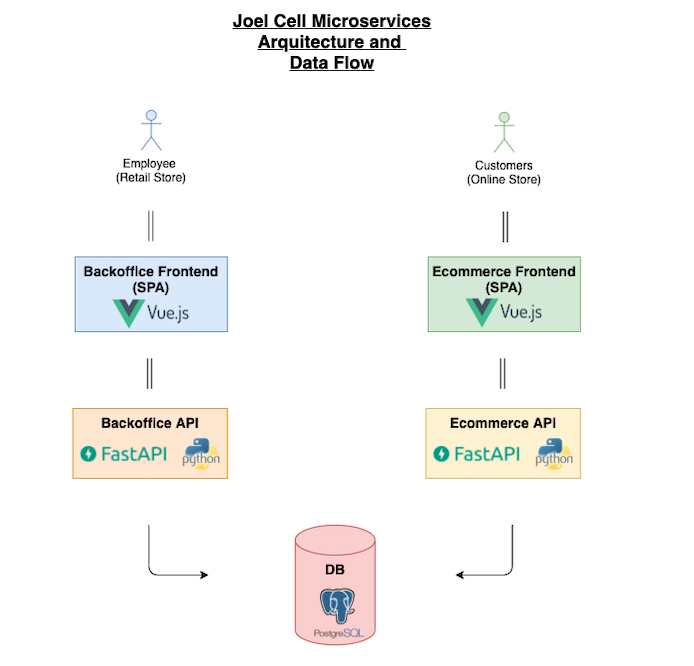

## POS Web Application with Online Store

Point of Sales system with E-Commerce capabilities built using a microservices arquitecture composed of 5 services:
 - A Vue JS Single Page Application containing the UI and frontend functionality for the backoffice. 
 - An Async Restful API built with FastAPI that serves as a controller for the backoffice. 
 - A PostgreSQL Database to persist data.
 - An Async Restful API built with FastAPI that serves as a controller for the online store.
 - A Vue Js Single Page Application for the e-commerce site. 

 Here's a diagram with the intended Arquitecture and Data Flow: 

## Features:
Some of the features include:
- Point of Sales
- Multiple Branches
- Inventory management (including low stock alerts)
- Purchase management
- Employee management
- Role management
- Custom Permissions to Roles and/or Users (Including one-time Authorization to resources).
- Email Notifications
- Multi-Factor Authentication
